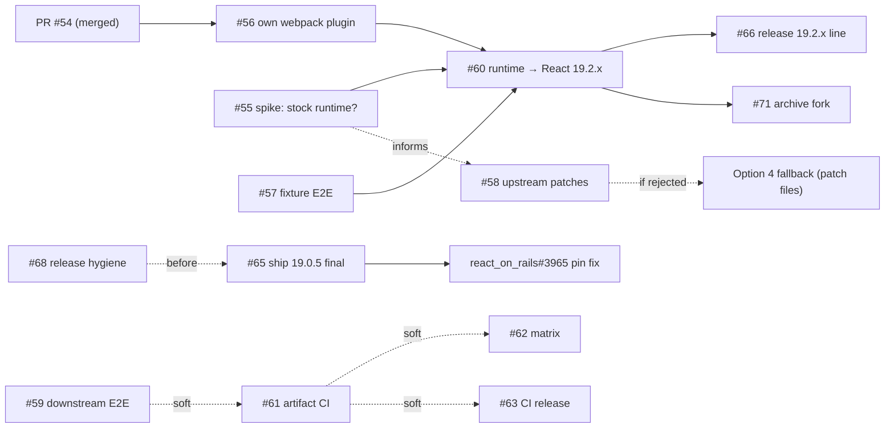

# Repository Improvement Audit — June 2026

**Status:** research record; decisions captured, execution tracked in
[#72](https://github.com/shakacode/react_on_rails_rsc/issues/72)
**Audit dates:** 2026-06-11 → 2026-06-12
**Backlog:** issues #55–#71 (labels `batch-a`/`batch-b`/`batch-c`) plus
[shakacode/react_on_rails#3965](https://github.com/shakacode/react_on_rails/issues/3965)
**Related docs:** [`releasing.md`](releasing.md),
[`eliminate-react-fork.md`](eliminate-react-fork.md),
[`open-rsc-work-status.md`](open-rsc-work-status.md)

This document is the durable record of the full repo deep dive: what was
verified, what it implies, and why the backlog is shaped the way it is. Facts
below were verified on the audit dates; re-verify anything status-sensitive
before acting on it months later.

> [!NOTE]
> Post-audit status update (2026-06-13): fork patch history is now preserved in
> `patches/archive/abanoubghadban-react/`. References below to the fork and
> `scripts/react-upgrade/` describe the audit-time legacy path unless explicitly
> marked otherwise.

---

## 1. Executive summary

The package is mechanically healthy (clean changelog-driven release script,
19 test suites, ~20 PRs merged Feb–Jun 2026) but had four strategic gaps:

1. **React 19.2 was not actually supported.** The vendored Flight runtime is
   built from React **19.0.4** sources while React stable is **19.2.7**.
   peerDeps (`^19.0.4`) let consumers run React 19.2 apps against the
   19.0.4-built runtime — it works incidentally, not by design.
2. **No true end-to-end test.** The closest was an rspack-only Flight
   round-trip; nothing tested webpack builds → SSR HTML → hydration, and
   nothing tested against the real consumer (the `react_on_rails` monorepo's
   pro dummy app, which already has a Playwright harness).
3. **Thin CI.** Jest-on-PR only, single Node version, and `yarn build` (the
   published artifact) never verified in CI. Releases ran from a laptop with
   an unpinned `npx release-it`.
4. **Release hygiene drift.** npm `rc` dist-tag stuck at `19.0.5-rc.5`, the
   `19.0.5-rc.5` git tag missing from origin, stale sections in
   `releasing.md`, and a wrong GitHub repo description ("Legacy early RSC
   example…").

**The decisive finding (§4):** the React fork's patch corpus is tiny — 5
webpack-plugin patches + 2 runtime patches — and stable
`react-server-dom-webpack` is now published on npm for every stable React.
That makes the optimal architecture the Next.js model: **stock upstream
runtime + bundler plugins owned in this repo as TypeScript** (§5–6). The
previously approved patch-file plan (`eliminate-react-fork.md` Option 4)
becomes the *fallback*, not the primary path.

### Report card (as of 2026-06-11)

| Area | Grade | Note |
| --- | --- | --- |
| Product architecture (separate pkg, wrappers, exports map) | A− | Public surface must stay stable throughout |
| Rspack plugin (fully owned TS) | A | The model the webpack side should follow |
| Vendoring strategy | C | Right call in the canary-only era; ecosystem moved |
| Tests | B | Strong rspack + (post-#54) webpack integration; no hydration E2E, no version matrix |
| CI | C− | PR-only, single Node, no build/artifact verification |
| Release process | B− | Good script; laptop-run, unpinned tooling, tag/dist-tag drift |
| Docs / agent setup | B− | Good plan docs; no CLAUDE.md at audit time (since added); status doc stale |

---

## 2. What this package is (verified)

`react-on-rails-rsc` (npm; `19.0.5-rc.7` on dist-tag `next` at audit time) =

- **Vendored, patched build** of React's `react-server-dom-webpack` in
  `src/react-server-dom-webpack/` (~1.8 MB of built JS), built from the fork
  `abanoubghadban/react` (`rsc-patches/v*` branches, `[RSC-PATCH]` commits)
  via `scripts/react-upgrade/` cherry-pick automation.
- **Custom TypeScript** (~1,200 lines): `WebpackPlugin` (thin wrapper over
  the vendored reference plugin), `WebpackLoader`,
  `RSCReferenceDiscoveryPlugin`, a fully-owned Rspack plugin/loader pair
  (`src/react-server-dom-rspack/`), and client/server renderer wrappers
  (`client.browser.ts`, `client.node.ts`, `server.node.ts`).
- **Consumer:** `packages/react-on-rails-pro` in the `shakacode/react_on_rails`
  monorepo — which pinned `react-on-rails-rsc: "*"` (wildcard; fix tracked in
  react_on_rails#3965). The pro dummy app
  (`react_on_rails_pro/spec/dummy`) has a Playwright harness — the natural
  downstream E2E integration point (#59).

### Version landscape (verified against npm, 2026-06-11)

| Thing | Version |
| --- | --- |
| React stable | **19.2.7** (`backport` line 19.1.8; 19.3 canary) |
| Vendored runtime here | **19.0.4** + FOUC (Flash of Unstyled Content)/runtime-chunk patches (#35) |
| Upstream `react-server-dom-webpack` stable on npm | **19.0.0–19.0.7, 19.1.0–19.1.8, 19.2.0–19.2.7** — full stable coverage |
| This package on npm | `latest=19.0.4`, `next=19.0.5-rc.7`, `rc=19.0.5-rc.5` (stale orphan tag) |
| peerDependencies | `react`/`react-dom` `^19.0.4`, `webpack ^5.59.0` |

Notable: upstream's own 19.0 line reached 19.0.7 — the vendored 19.0.4 was
behind even on its own line. PR #11's 19.2.1 target predated the December
2025 RSC security wave (this repo's rc.5 notes document replacing a
19.0.3-based bundle for CVE-2025-55183/55184/67779).

---

## 3. Test & CI findings

- 19 test files / ~3.5k lines at audit time. Strong: rspack plugin fixtures
  (10 scenarios), rspack-compat suite (ABI checks + a real encode/decode
  round-trip in `tests/rspack-compat/end-to-end.rspack.test.ts`). PR #54
  added the first **real-webpack** integration suite
  (`tests/webpack-plugin/`, child-process builds, no mocked internals).
- **Missing:** Flight → SSR HTML → hydration coverage (most rc.1–rc.7
  regressions — chunk overwrite/merge, CSS-before-JS ordering, runtime-chunk
  CSS leak, FOUC, `publicPath: "auto"` — lived exactly there); version
  matrix (React/webpack/rspack/Node); error-path coverage; any test against
  the Rails consumer. → #57, #62, #64, #59.
- **CI:** `unit-tests.yml` ran jest on `pull_request` only (Node 20.x);
  `yarn build` and the 11-path `exports` map were never CI-verified — a
  broken artifact surfaces only at publish. → #61.
- The `claude-review` failure on PR #54 was an action-internal bug in
  unpinned `anthropics/claude-code-action@v1`, not a code issue. → #69.

## 4. The decisive finding: fork patch inventory & drift

Fork branch inventory (`abanoubghadban/react`): `rsc-patches/v19.0.1`,
`rsc-patches/v19.0.3`, `rsc-patches/v19.2.1` — **no `v19.0.4` branch**,
despite the vendored runtime claiming 19.0.4. The fork and the vendored tree
had already diverged.

The complete `[RSC-PATCH]` corpus:

| Patch | Target | Class |
| --- | --- | --- |
| Add server support for React Flight Webpack Plugin | plugin | plugin |
| Make RSC plugin create a manifest for server build | plugin | plugin |
| Fix chunk-merge bug in `recordModule` | plugin | plugin (superseded by #54's algorithm) |
| Fix client manifest chunk scan when non-JS assets precede JS | plugin | plugin |
| Filter runtime chunk from per-module client manifest chunks | plugin | plugin |
| Walk parsed JSON instead of reviver for RSC payload parsing | Flight client | **runtime** (perf; landed here via #33; fork branch `perf/rsc-revive-model-walk`) |
| Fix FOUC for use-client CSS in deferred Suspense subtrees | Flight client/SSR | **runtime** (landed here via #35; fork branch `fix/3211-rsc-css-deferred-suspense`) |

Additional facts:

- The single `[RSC-REPLACE]` commit just renames `react-server-dom-webpack`
  → `react-on-rails-rsc` inside built files — moot once wrappers import the
  real npm package.
- The vendored built plugin file accumulated **8+ direct in-repo edits**
  after the last fork build (#23, #33, #42, #43, #47, #52, rc.6 hardening,
  #54). The team was already maintaining the plugin as first-class code — in
  built-artifact form, with no types, lint, or normal review.

**Implication:** the plugin patches disappear by owning the plugin (#56);
only 2 runtime patches stand between this repo and a stock upstream runtime
(#55/#58/#60).

## 5. Ecosystem comparison: how Next.js does it (verified against vercel/next.js)

- Next.js **never forks or patches React source.** It vendors *unmodified,
  precompiled* upstream builds (`packages/next/src/compiled/
  react-server-dom-webpack{,-experimental}`, plus turbopack variants) of
  pinned versions; needed changes land upstream.
- Next.js **writes its own bundler plugins** — `flight-client-entry-plugin.ts`,
  `flight-manifest-plugin.ts`, `rspack-flight-client-entry-plugin.ts`. It
  does not use React's reference `ReactFlightWebpackPlugin` (the file all
  five of our plugin patches modify). The reference plugin is a starting
  point, not a product.
- Caveat on copying: Next.js vendors compiled copies because it is a
  *framework* shipping one pinned (canary) React inside itself. This repo is
  a *library* installed into apps on stable React — so the even simpler move
  is available: **depend on the matching stable `react-server-dom-webpack`
  from npm.**

## 6. Strategy decision

**Primary (Option 5 — pending #55 spike confirmation):**

```text
react-on-rails-rsc =
  dependency: react-server-dom-webpack: "~19.2.7"        (stock npm; bounded to the 19.2 runtime line; bump package floor when upstream floor rises)
  src/webpack/RSCWebpackPlugin.ts                (owned TS; #56)
  src/react-server-dom-rspack/                   (already owned)
  client/server wrappers                         (import the real package)
  peerDeps: react/react-dom ^19.2.7              (floor raise from ^19.0.4 is semver-breaking; validate later minors in #62 before claiming support)
```

Wins: deletes ~1.8 MB of vendored built code; React upgrades become a
dependency bump + matrix run; npm makes security fixes available same-day, while
#63/#66 keep this package's release path responsible for dependency and peer
floor bumps; all bundler logic reviewable TS; `[RSC-REPLACE]` and the fork die.

**Post-audit update (#55):** the stock-runtime spike selected Option 5 (GO) and
replaced this section's original 2-patch gate with a 3-delta migration
inventory in `eliminate-react-fork.md`: JSON-walk parsing is upstreamed in
facebook/react#35776 but not in 19.2.7, the current FOUC fix is an in-repo
rewrite that #60 should re-implement at the wrapper layer, and the
`loadServerReference` bound-args delta needs explicit bound-server-action smoke
coverage in #60. If any #60 gate fails, fall back to `eliminate-react-fork.md`
Option 4 (patch files applied to vanilla `facebook/react`).

Note: GitHub's search API rejects queries against `facebook/react`, so the
upstream-status check must be done by cloning + `git log`/diff (recorded in
issue #55).

## 7. Release & verification recommendations (summary)

- Keep the changelog-driven design (version read from `CHANGELOG.md`,
  **no-`v`-prefix tags**, prereleases → `next` only). Move execution into
  GitHub Actions with npm **trusted publishing (OIDC) + `--provenance`**;
  pin or remove `release-it` (#63). Fix dist-tag/tag drift (#68).
- **Verification ladder** (one entry point, used by humans, CI, and skills):
  1. `yarn test` (unit + integration)
  2. artifact tier: build → pack → tarball-install → resolve all 11 export
     paths under default + `react-server` conditions → `publint` → `attw` →
     embedded-runtime-version assertion (#61)
  3. fixture-app E2E, webpack + rspack, from the packed tarball: Flight →
     SSR HTML → hydration with zero hydration errors (#57)
  4. downstream: tarball into the pro dummy app, RSC Playwright subset,
     nightly + pre-promotion (#59)
- The rc.4→rc.5 incident (an RC shipping a runtime still reporting 19.0.3)
  is the canonical case tiers 2–3 exist to catch.
- Agent setup: `CLAUDE.md` + `.claude/skills/` as thin wrappers over the
  same scripts (#67).

## 8. The backlog

Tracking issue: **#72**. Three difficulty-ordered batches run through the
`pr-batch`/`plan-pr-batch` skills in this repo (`.agents/skills/`). Default
order is A → B → C, with the explicit exception that #68 from Batch C is pulled
forward before #65 in Batch B.

| Batch | Issues | Notes |
| --- | --- | --- |
| A (hardest) | #55 #56 #57 #58 #59 #60 | #60 last; hard-blocked by #55+#56+#57; #59 supplies soft evidence for #61 |
| B | #61 #62 #63 #64 #65 #66 | #65 time-sensitive (pull forward, no Batch-A dependency); #66 hard-blocked by #60 |
| C | #67 #68 #69 #70 #71 + react_on_rails#3965 | #68 pull forward (before #65); #71 blocked by #60; #3965 blocked by #65 |



**Critical path:** #55/#56/#57 can proceed in parallel; all three gate #60,
which then gates #66. #55 also informs #58.

## 9. Triage outcomes during the audit

- PR **#54** merged 2026-06-12 (dependency-type client manifest; closed #22).
- PR **#21** closed as superseded (fix had landed as #23; algorithm replaced
  by #54).
- PR **#11** closed as superseded (19.2.1 fork rebuild replaced by the
  #55/#60 plan; its fork branches feed #58).
- Labels `batch-a`/`batch-b`/`batch-c` created; backlog #55–#71 +
  react_on_rails#3965 filed.

## Appendix A — verification methodology

Key checks behind the claims above (re-runnable):

```bash
npm view react dist-tags --json
npm view react-server-dom-webpack versions --json   # stable lines exist
npm view react-on-rails-rsc dist-tags --json        # rc-tag drift
git ls-remote --tags origin                         # missing 19.0.5-rc.5
gh api --paginate 'repos/abanoubghadban/react/commits?sha=rsc-patches%2Fv19.2.1'  # patch corpus; copy output to #58/#71 before archive
git log --oneline --follow -- src/react-server-dom-webpack/cjs/react-server-dom-webpack-plugin.js  # drift
gh api repos/vercel/next.js/contents/packages/next/src/compiled    # Next.js vendoring
gh api repos/vercel/next.js/contents/packages/next/src/build/webpack/plugins  # Next.js own plugins
```

## Appendix B — open questions / risks

1. Upstream landing status of the FOUC + JSON-walk patches (blocked GitHub
   search API; resolve in #55 by local clone).
2. Wrapper feasibility of the FOUC behavior if not upstream (assessed in #55).
3. Exports/conditions parity between our 11-path map and stock
   `react-server-dom-webpack` (assessed in #55; guarded forever by #61).
4. 19.0.x maintenance window once 19.2.x is `latest` (decided in #70's
   versioning policy; announced in #66).
5. Mixed React versions in consumer apps (runtime vs react-dom skew) —
   covered by the #62 matrix and peerDeps policy.
